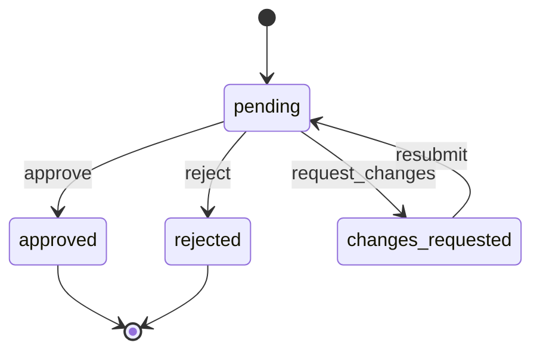
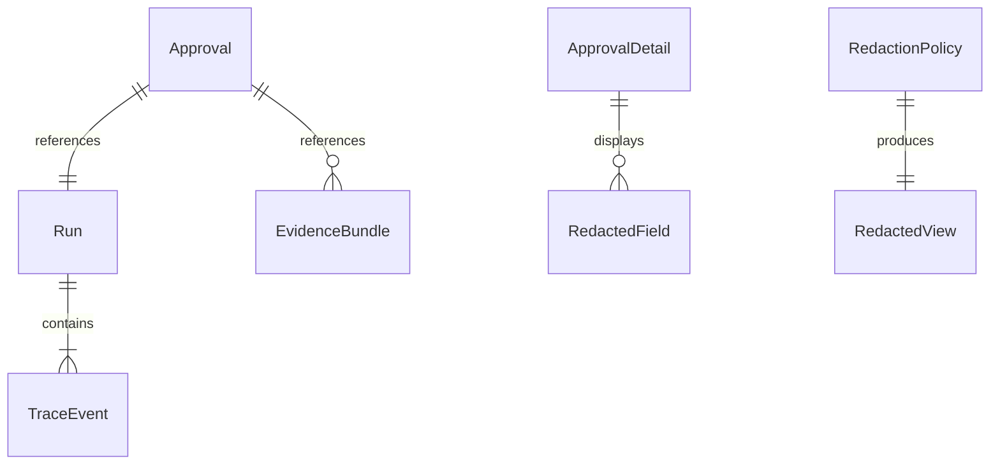

# Domain Model

Phase 1 domain model for GroundSealOperatorConsole. See [`docs/glossary.md`](glossary.md) for term definitions and [`docs/contracts/`](contracts/README.md) for public contract shapes.

## Approval Lifecycle

### Status Semantics

| Status | Terminal | Operator actions |
|--------|----------|------------------|
| pending | no | approve, reject, request_changes |
| approved | yes | none |
| rejected | yes | none |
| changes_requested | no | resubmit (platform-initiated, Phase 2+) |

## Invariants

1. **Terminal immutability**: `approved` and `rejected` cannot transition to any other status via ApprovalDecision.
2. **Reason required**: `reject` and `request_changes` decisions MUST include a non-empty trimmed reason.
3. **Role gate**: Only `reviewer` and `admin` roles may submit decisions; `viewer` is read-only.
4. **Tenant scope**: All reads and writes scoped by `tenantId`; cross-tenant access returns `TENANT_ACCESS_DENIED` or `NOT_FOUND` without leaking existence.
5. **Run integrity**: Every ApprovalDetail.runId MUST resolve to a RunTimeline for the same tenant.
6. **Redaction before display**: ApprovalDetail.redactedPreview MUST be produced by RedactedPresentation policy, never from raw payload passthrough.
7. **Timeline ordering**: RunTimeline events MUST be non-decreasing by timestamp; violation yields `MALFORMED_TIMELINE`.
8. **Audit trail**: Every successful decision MUST return a non-empty `auditRef`.

## Entity Relationships

## Core Types (Implementation)

| Type | Location | Notes |
|------|----------|-------|
| ApprovalStatus | `src/contracts/approval.ts` | Enum of four states |
| TenantContext | `src/contracts/tenant.ts` | Required on all scoped operations |
| TraceEvent | `src/contracts/run.ts` | payloadRef, not raw payload |
| RedactionPolicy | `src/contracts/redaction.ts` | mask / omit / hash rules |
| ErrorCode | `src/contracts/errors.ts` | Machine-readable failures |

## Fixture Scenarios

| Fixture | Category | Purpose |
|---------|----------|---------|
| `approval-queue-query.json` | ContractValidation | Valid queue query |
| `approval-detail.json` | ContractValidation | Expected detail shape |
| `approval-decision-approve.json` | ApprovalStateMachine | Happy approve path |
| `approval-decision-reject.json` | ApprovalStateMachine | Reject with reason |
| `run-timeline.json` | ContractValidation | Ordered timeline |
| `redaction-pii.json` | RedactionSafety | PII masking fixture |
| `malformed-timeline.json` | NegativePath | Out-of-order events |

## Resubmit (Phase 3+)

Platform-initiated `changes_requested → pending` via `resubmitApproval`. See [`docs/resubmit-handshake.md`](resubmit-handshake.md).

## Phase 2 Scope Boundary

Phase 2 covered core approval path only. Phases 3–7 added resubmit, HTTP adapter, persistence, eval ratchet, and operator UI.
