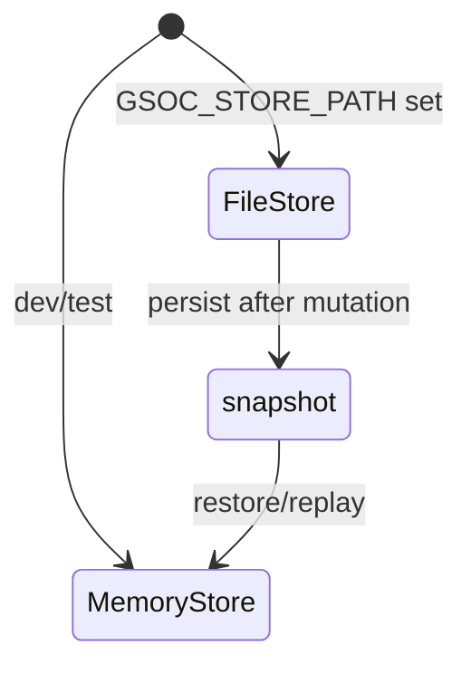

# Persistence

Phase 6 durable behavior via JSON file snapshot.

## FileStore

[`src/adapters/file-store.ts`](../src/adapters/file-store.ts) wraps `MemoryStore` and persists after every mutation.

```typescript
import { FileStore } from "./adapters/file-store.js";

const store = new FileStore("./data/store.json");
```

## Snapshot format

```typescript
interface StoreSnapshot {
  version: 1;
  approvals: InternalApproval[];
  runs: InternalRun[];
  auditLog: AuditEntry[];
}
```

## Replay

[`src/core/replay.ts`](../src/core/replay.ts) loads a snapshot into a fresh store and verifies:

- Approval count matches
- Each approval is readable via `getApprovalDetail`
- Audit log length preserved

## Lifecycle



## Migration concerns

- Snapshot `version` field reserved for future schema changes
- Phase 6 does not migrate across versions; unsupported version throws

## Tests

[`tests/adapters/file-store.test.ts`](../tests/adapters/file-store.test.ts)
